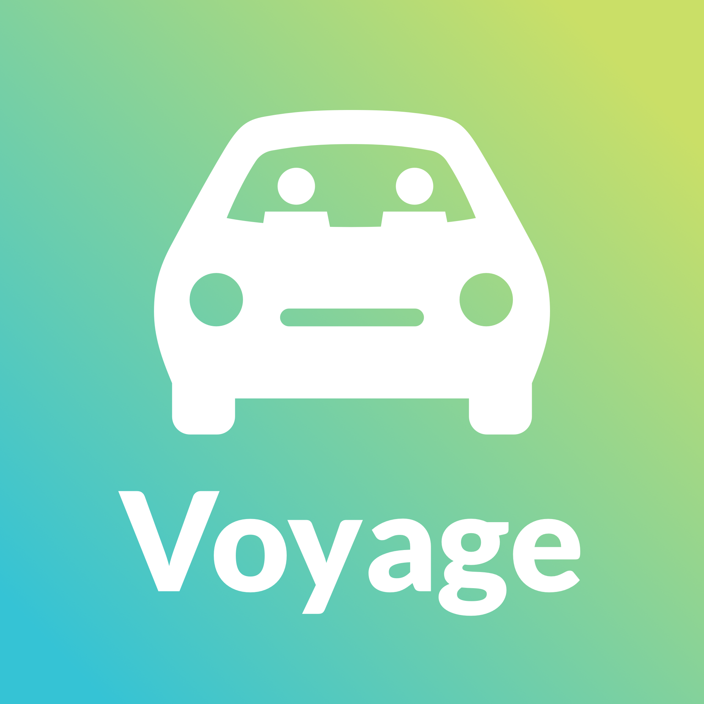

# Voyage

## About
Voyage was a product idea created during Viasat's 2018 Summer Internship
Hackathon.  Working with a team of interns, we created Voyage, an internal,
incentive-based, ride share program.  Voyage aims to help employees meet
coworkers across various segments of the company as well as reduce Viasat's
carbon footprint.

## What I Worked On

During the hackathon, I worked on UI/UX, designing the full flow of the mobile
application, as well as some other marketing materials for our pitch.

The pitch deck can be found [here](media/pitch-deck.pdf)
